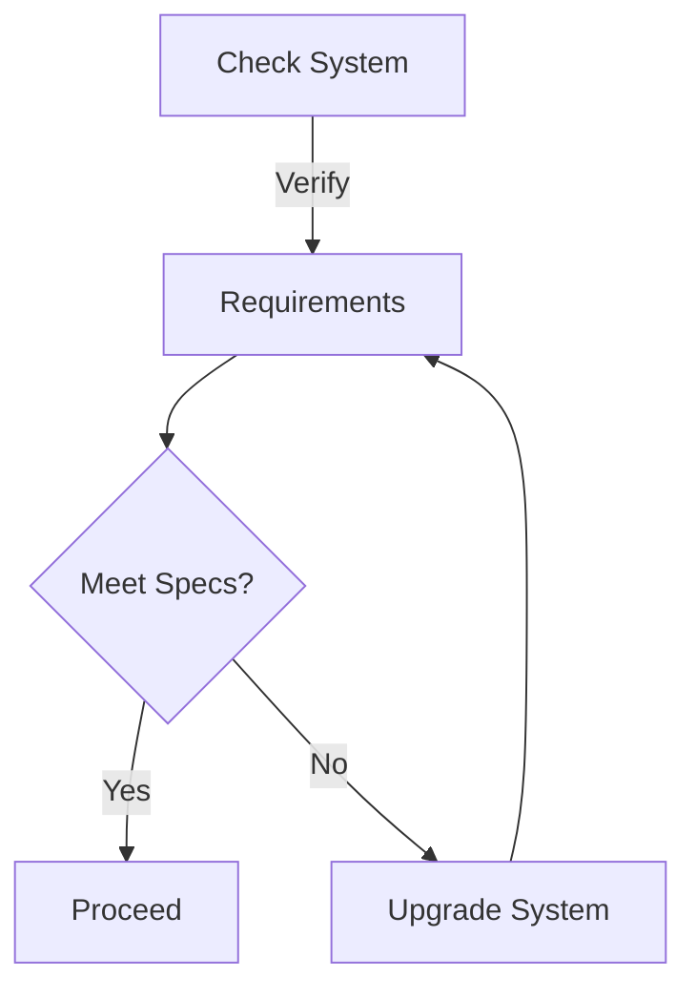

# 🔧 Troubleshooting

## ❗ Common Issues




### Error: "Failed to Launch Proxy"


This issue is commonly related to Windows Defender blocking necessary files.


#### Solution Steps

1. **Add Required Exclusions:**

   ```plaintext
   %localappdata%\Roblox\
   ```

2. **Configure Windows Defender:**
   * Open Windows Start menu
   * Search for "Windows Security"
   * Click "Virus & threat protection"
   * Select "Manage settings"
   * Scroll to "Exclusions"
   * Click "Add or remove exclusions"
   * Choose "Add an exclusion" > "Folder"
   * Add the path above

### Error: "Client Not Up To Date"


This occurs when Windows security prevents proper updates.


#### Required Exclusions

```plaintext
%localappdata%\Roblox\
AppData\Local\ui
```

#### Resolution Steps

1. Type `/guide` in ⁠commands channel
2. Follow the guide instructions
3. Add both directories as exclusions
4. Restart AWP.GG application




#### Installation Errors

##### Error: "Installation failed due to missing prerequisites"


**Follow these steps:**

1. Check [Prerequisites](../getting-started/prerequisites.md) are installed
2. Verify system compatibility
3. Run installer as administrator


##### Error: "Access Denied During Installation"


**Quick Fix:**

1. Right-click installer
2. Select "Run as administrator"
3. Try installation again





#### License Activation Problems

##### Error: "Invalid license key"


**Verification Steps:**

1. Double-check license key format
2. Verify key hasn't expired
3. Ensure key isn't already in use


##### Error: "License Server Unavailable"


**Resolution Steps:**

1. Check internet connection
2. Disable VPN if active
3. Wait 5 minutes and retry





#### Software Crashes

##### Issue: "AWP.GG crashes on startup"


**Follow these steps:**

1. Check [Security Setup](../getting-started/security-setup.md)
2. Update to latest version
3. Install pending Windows updates


##### Issue: "Performance Problems"


**Optimization Steps:**

1. Close unnecessary applications
2. Update graphics drivers
3. Check system resources




## 🎮 Game-Specific Issues




### ROBLOX Integration Problems

1. **Game Not Detected**
   * Close ROBLOX completely
   * Restart AWP.GG as administrator
   * Launch ROBLOX through AWP.GG

2. **Script Execution Errors**
   * Verify antivirus is disabled
   * Check Windows Defender settings
   * Ensure proper permissions




#### Connection Problems

1. **Server Connection Lost**
   * Check internet connection
   * Disable VPN/Proxy
   * Verify firewall settings

2. **High Latency**
   * Close background applications
   * Check internet speed
   * Try different server region



## Advanced Troubleshooting




### Important Directories

```plaintext
Main Application: %localappdata%\ui
ROBLOX Files: %localappdata%\Roblox\
Temporary Files: %temp%
```





### Useful Discord Commands

* `/guide` - View complete setup guide
* `/download` - Get latest version
* `/claim` - Activate license



## 📞 Support Channels




### Discord Communities

| Server | Purpose | Link |
|---------|---------|------|
| Support Server | Direct assistance | [Join Support](https://discord.gg/buyawp) |
| Official Server | Updates & news | [Join Official](https://discord.gg/awpgg) |





#### Other Resources

* [📚 Documentation](../getting-started/installation.md)
* [❓ FAQ](faq.md)
* [🔧 Setup Guide](../getting-started/prerequisites.md)



## 🔄 Quick Fixes

### Common Solutions Checklist


Try these steps before contacting support:

1. ✅ Restart AWP.GG and ROBLOX
2. ✅ Check for software updates
3. ✅ Verify security settings
4. ✅ Run as administrator
5. ✅ Clear cache files


### System Requirements Verification



## 📈 Performance Optimization

### Recommended Settings


Optimize your experience:

* Keep AWP.GG and ROBLOX updated
* Close unnecessary background apps
* Regular system maintenance
* Monitor resource usage



Remember to save your settings before making any changes!

