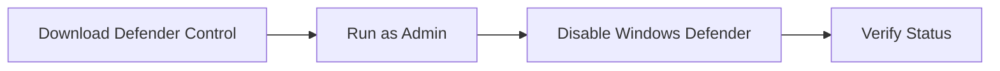

# 🛡️ Security Configuration

## ⚠️ Important Notice

  
Antivirus software may interfere with AWP.GG's functionality. Temporary deactivation is required for proper operation.

## Windows Defender Configuration

### Method 1: Defender Control Tool

🔗 [Download Defender Control v1.5](https://github.com/qtkite/defender-control/releases/tag/v1.5)

### Method 2: Manual Configuration

📺 Follow our [detailed video guide](https://www.youtube.com/watch?v=UKu6qtc534A)

## 🔒 Windows Security Settings

### Step 1: Firewall Settings

  <h4>Navigate to Windows Security:</h4>
  <ol>
    <li>Open Windows Security</li>
    <li>Select "Firewall & Network Protection"</li>
    <li>Disable all protection features</li>
  </ol>

### Step 2: Browser & App Protection

  <h4>Configure App & Browser Control:</h4>
  <ol>
    <li>Open "App & Browser Control"</li>
    <li>Access "Reputation-based protection settings"</li>
    <li>Disable all features</li>
  </ol>

## 🗑️ Third-Party Antivirus Removal

Follow these steps to remove other antivirus software:

1. Open Control Panel
2. Navigate to "Programs"
3. Click "Uninstall a program"
4. Remove your antivirus
5. Restart your PC

  
Need help? Search "[Your Antivirus Name] complete uninstall guide" for specific instructions.

