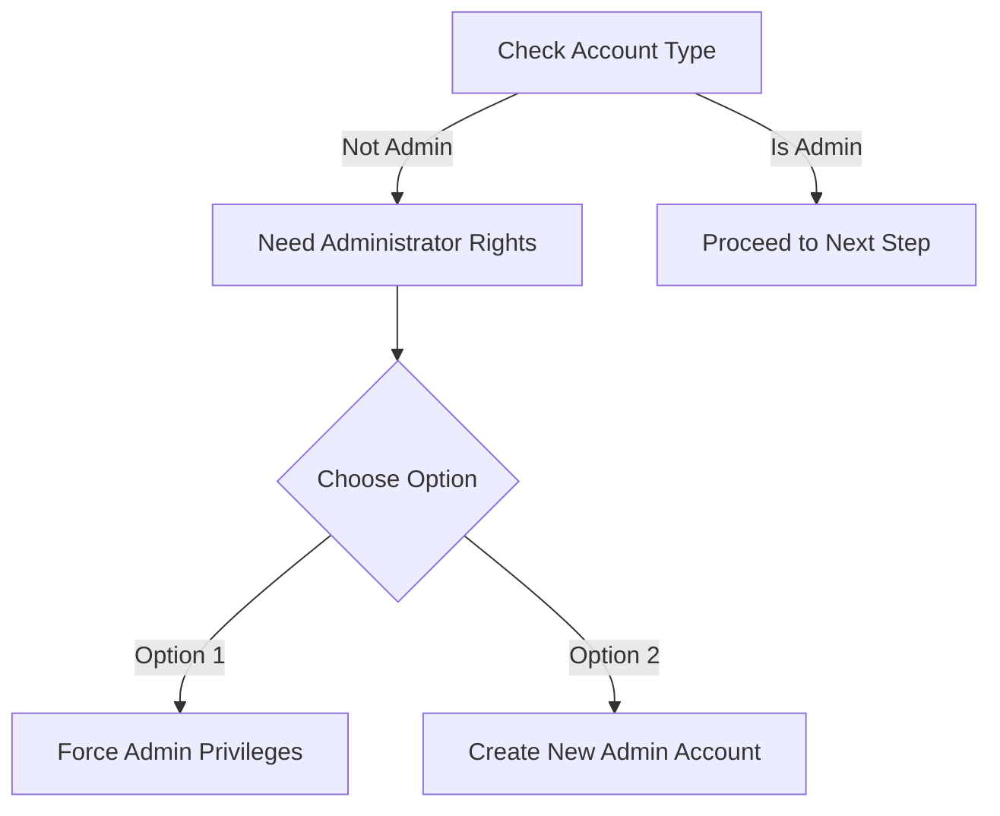

# 💻 Prerequisites

## System Requirements

### 🔒 Windows Account Requirements

### ⚙️ System Compatibility Check

  
Before proceeding, verify your system meets these requirements:

#### Windows Version Check
1. Press `Windows + R`
2. Type `msinfo32` and press Enter
3. Look for "System Type"
   - ✅ Should show: "x64-Based PC"

## 📥 Required Software

### Visual C++ Redistributables

Download and install both packages:

| Version | Download Link | Status |
|---------|--------------|---------|
| x64 | [Download VC_Redist x64](https://aka.ms/vs/17/release/vc_redist.x64.exe) | Required |
| x86 | [Download VC_Redist x86](https://aka.ms/vs/17/release/vc_redist.x86.exe) | Required |

### ROBLOX Installation

  
Follow these steps for a clean ROBLOX installation:

1. **Uninstall Existing ROBLOX:**
   - Use Revo Uninstaller
   - ⚠️ Select ALL registry keys
   - 🗑️ Remove associated folders

2. **Fresh Installation:**
   - Download latest ROBLOX version
   - Run as administrator