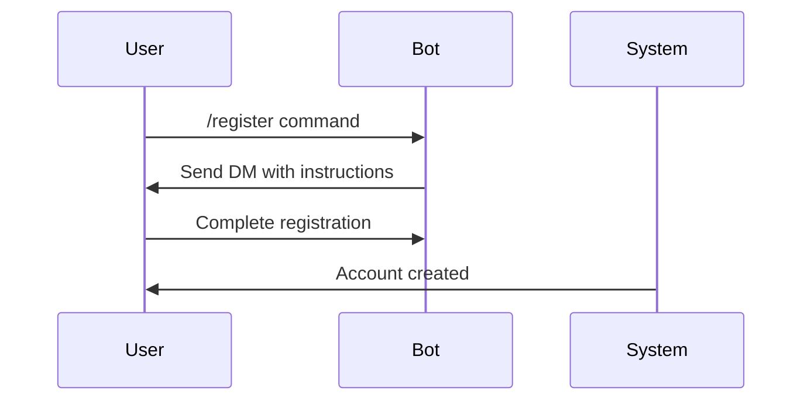
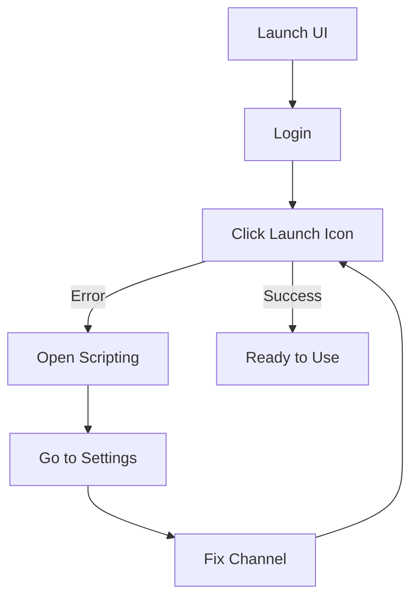

# 📦 Installation Guide

## 🔑 License Verification

  
A valid license key is required to proceed!

## 👤 Account Setup

### Registration Process

### License Activation

  <h4>📝 License Claims:</h4>
  <ul>
    <li>Use /claim to activate your license</li>
    <li>New duration adds to existing subscription</li>
  </ul>

## 💾 Software Installation

### Download Process

1. Execute `/download` command
   

  
⚠️ Download links are single-use only!

  
⚠️ Sharing links will result in immediate license suspension

### Installation Steps

  <h4>Pre-Installation Checklist:</h4>
  <ul>
    <li>✅ ROBLOX is fully closed</li>
    <li>✅ Prerequisites are installed</li>
    <li>✅ Antivirus is disabled</li>
  </ul>

## 🚀 First Launch

### Launch Sequence

## 🗑️ Uninstallation

To remove AWP.GG:

1. Open UI
2. Navigate to Scripting > Settings
3. Click "Remove Awp"
4. Reinstall ROBLOX

  
Keep this documentation handy for future reference!

