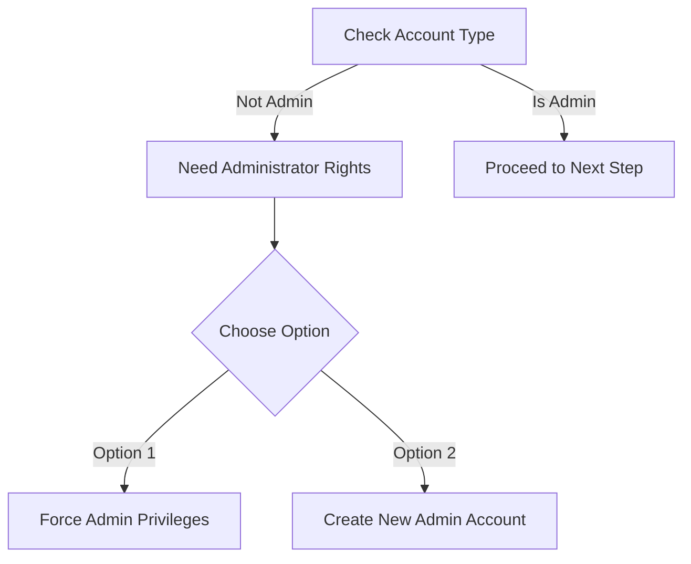

# Prerequisites

## 💻 Prerequisites

### System Requirements

#### 🔒 Windows Account Requirements

#### ⚙️ System Compatibility Check

Before proceeding, verify your system meets these requirements:

**Windows Version Check**

1. Press `Windows + R`
2. Type `msinfo32` and press Enter
3. Look for "System Type"
   * ✅ Should show: "x64-Based PC"

### 📥 Required Software

#### Visual C++ Redistributables

Download and install both packages:

| Version | Download Link                                                             | Status   |
| ------- | ------------------------------------------------------------------------- | -------- |
| x64     | [Download VC\_Redist x64](https://aka.ms/vs/17/release/vc_redist.x64.exe) | Required |
| x86     | [Download VC\_Redist x86](https://aka.ms/vs/17/release/vc_redist.x86.exe) | Required |

#### ROBLOX Installation

Follow these steps for a clean ROBLOX installation:

1. **Uninstall Existing ROBLOX:**
   * Use Revo Uninstaller
   * ⚠️ Select ALL registry keys
   * 🗑️ Remove associated folders
2. **Fresh Installation:**
   * Download latest ROBLOX version
   * Run as administrator
